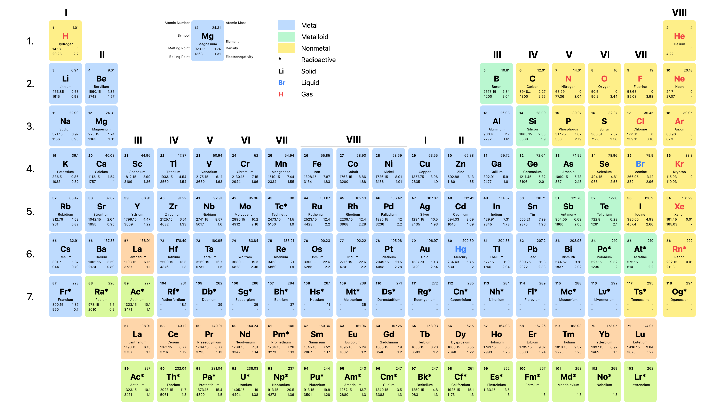

# Chemistry 🧪

Web application providing a visual representation of chemical structures. The app comes with a set of useful tools to help you exploring the chemical world.



## Getting Started 🚀

First, run the development server:

```bash
npm run dev
# or
yarn dev
```

Open [http://localhost:3000](http://localhost:3000) with your browser to see the result.

You can start editing the page by modifying `pages/index.tsx`. The page auto-updates as you edit the file.

[API routes](https://nextjs.org/docs/api-routes/introduction) can be accessed on [http://localhost:3000/api/hello](http://localhost:3000/api/hello). This endpoint can be edited in `pages/api/hello.ts`.

The `pages/api` directory is mapped to `/api/*`. Files in this directory are treated as [API routes](https://nextjs.org/docs/api-routes/introduction) instead of React pages.

## Features 🎨

Currently the app only shows the periodic table. There are plans to add more features in the future.

**Planned Features:**

- Oxidation Calculator
- Reaction Calculator

### Periodic Table 🔬

The periodic table is a visual representation of the elements and their properties. You maybe already familiar with it.

By clicking on an element, the element's full name will be copied to your clipboard. You can also search for an element by typing its name or symbol in the search bar.

## Localization 🌍

The app is available in multiple languages. You can change the language by navigating to the `/en`, `/de` or `/fr` route.

We would love to see your translation! Don't hesitate to [open an issue](https://github.com/michaelbeutler/chemistry/issues/new) or [submit a pull request](https://github.com/michaelbeutler/chemistry/compare) to add your language.

## Built with 💖

This is a [Next.js](https://nextjs.org/) project bootstrapped with [`create-next-app`](https://github.com/vercel/next.js/tree/canary/packages/create-next-app).

- [Next.js](https://nextjs.org/) is a framework for building fast and responsive web applications.
- [Tailwind CSS](https://tailwindcss.com/) is a utility-first CSS framework for quickly building complex layouts.
- [React](https://reactjs.org/) is a JavaScript library for building user interfaces.
- [TypeScript](https://www.typescriptlang.org/) is a type-checking language for JavaScript.

## Authors 👨‍💻

- **Michael Beutler** - _Initial work_ - [MichaelBeutler](https://github.com/MichaelBeutler)

## License 📃

[MIT](https://choosealicense.com/licenses/mit/)

## Contributing 🤝

Pull requests are welcome. For major changes, please open an issue first to discuss what you would like to change.

Please make sure to update tests as appropriate and meet the quality gate requirements.
